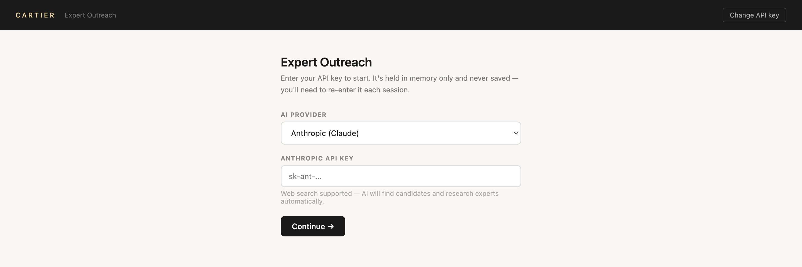

# Expert Outreach Tool

A browser-based tool for finding LinkedIn experts and drafting personalised outreach, built for Cartier Digital Innovation & AI. No install, no backend, no build step — open `index.html` and go.

**[▶ Watch the 2-minute demo](https://www.loom.com/share/e2cb2a8c762d446c8a30d57826498110)**

---

## Run it

1. Download or clone this repo
2. Open `index.html` in Chrome, Safari, or Firefox (`file://` works)
3. Enter your API key — it stays in your browser and is only ever sent to the AI provider you pick

---

## What it does

**Start a new campaign** — four steps, each reviewable before the next:

1. **Discover** — AI generates search queries and returns relevant experts (name, title, LinkedIn, why they're relevant). Or add people manually.
2. **Profiles** — paste each person's LinkedIn text or other context. Skip anyone you don't want.
3. **Briefs** — AI writes a short brief per person: who they are, why they're relevant, a score, and the best hook.
4. **Messages** — AI drafts a personalised message per person. Choose **Long** (a few paragraphs) or **Short** (under 200 characters, for connection requests). Copy, edit, revise, or regenerate each; export all as markdown.

**Quick Add** — already running a campaign? Pick it, paste one or more profiles, choose a format, and briefs + messages are generated and appended in one step.

---

## AI providers

| Provider | Web search |
|---|---|
| Anthropic (Claude) | Yes |
| OpenAI (GPT) | Yes |
| DeepSeek | No — queries shown for manual search |
| Qwen (Alibaba) | No — queries shown for manual search |

API keys are stored only in your browser and never sent anywhere except the provider's own endpoint.

---

## Customising

Everything lives in `index.html`. Common edits:

| What | Where |
|---|---|
| Sign-off name / team | search for `Nitya Negi` in the `<script>` |
| Message style examples | `OUTREACH_EXAMPLES_LONG` / `OUTREACH_EXAMPLES_SHORT` |
| AI model | `PROVIDERS` object |
| Message rules | `msgSystemPrompt` in `generateAllMessages()` |

The exact prompts sent at each step are defined inline in `index.html`, and real style-reference messages live in `examples/outreach_examples.txt`.
